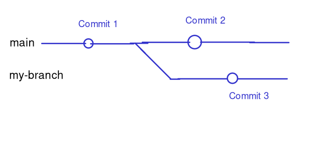

# Branching

[<< Index](readme.md) [< Back](4-merge-conflicts.md) | [Next >](6-pull-requests.md)

In this page we'll talk about **branches** and how to **merge** them.

Sometimes, it's useful to split off your code into a separate line of commits. 
For example, if I'm working on a somewhat in-depth feature, but the rest of my
team has to continue making changes to the code while I do it, it's helpful for
us to each be working on our own copy of the code, so that others' modifications
don't complicate our train of thought.

The standard way of doing this (such that I can still save my code on GitHub
without it entering the mainline code) is to use **branches**.

## Creating a branch

To create a branch, run the command:
```sh
git checkout -b <branch-name>
```

This will create a branch with a given name, and will "checkout" the new branch.
This means that any commits you create will be applied to the new branch.

As an example, lets say I make commit 1 on the `main` branch, then run 
`git checkout -b my-branch`. Then, my teammates make commit 2 on `main`, while
I make commit 3 on `my-branch`. The graph of what the branches history looks like
(pardon my bad diagram):



Here, I can only see commits 1 and 3 on `my-branch`, while my teammates only see
commits 1 and 2 on `main`.

Just branching by itself isn't all that useful though, we also need a way to merge them. We will cover this below.

## Checking what branches exist (and which you're using)

You can check what branch you are on by running the command:
```
git branch
```

This will list all the branches that have been created, with an asterisk next to the one you are currently on.

## Switching branches

To switch which branch you have on your computer, run the command:
```
git checkout <branch-name>
```

For example, I may want to temporarily stop work on `my-branch` to sort out a 
critical issue in the `main` branch. To do so, I'd run `git checkout main`.
Once I have finished this work and pushed it to GitHub, I can switch back by
running `git checkout my-branch`.

**NOTE: git may require you to commit the work you have currently before**
**switching branches. If you want to avoid having a "saving work" commit**
**in your repository, save your work by running the command `git stash`.**
**When you switch back to your branch, you can restore this code by running**
**`git stash pop`.**

## Using a branch

After you've made your commits to your new branch, you can push your branch to
GitHub.

You can `git push` branches similarly to how you would normally, but you may
need to specify a bit more information the first time you push this branch:

**WARNING: Make sure that you are on the correct branch before running the**
**following command (see "Checking what branches exist")**

```
git push -u origin <branch-name>
```

This command pushes your branch, and sets up git on your machine to track
the right branch on GitHub. 

## Merging Branches

Once you've finished work on your branch, it would be nice to be able to merge
it back with the mainline code. 

**While git does allow us to merge branches via the command line, we strongly**
**recommend using GitHub's "Pull request" mechanism, which we discuss** 
**[here](6-pull-requests).**

If you need to fall back to the command line, then first checkout the branch
you want to merge into (this will usually be `main`), then run
`git merge <branch-name>` to merge the named branch into your current one.

